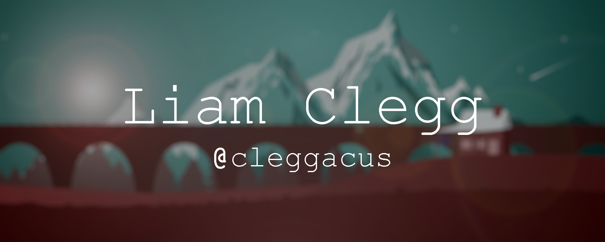

Hey my name is Liam and I am a Web Developer / Software Engineer from the UK currently studying for a bachelor's degree in computer science at Swansea University.

## Stats

## Skills
### Web

### Languages

### Editors

## Contact me here:

